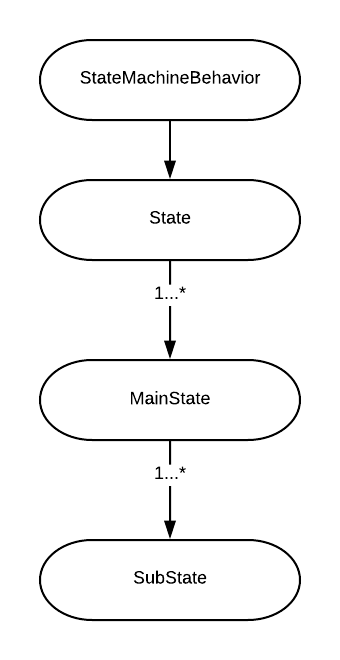
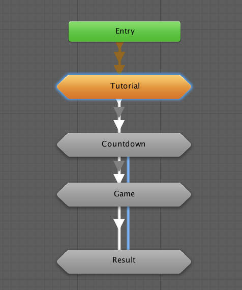
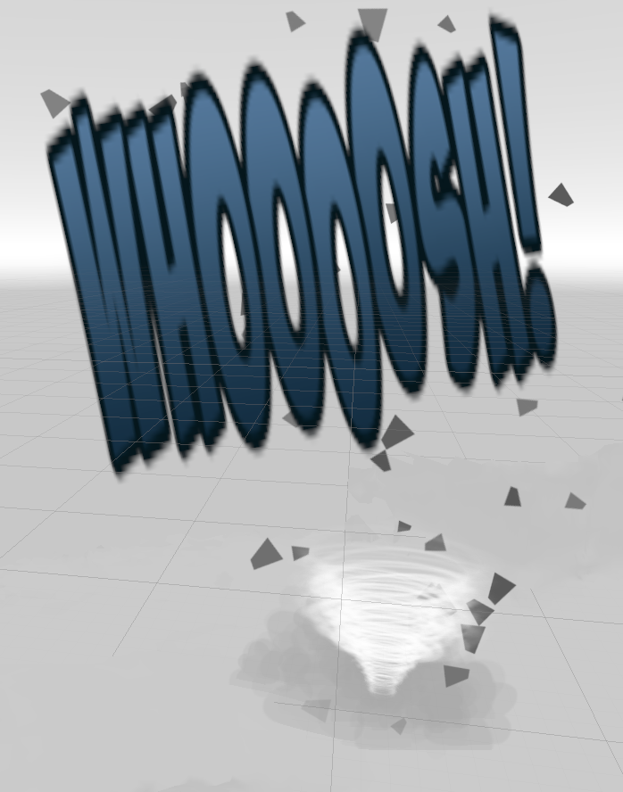

# Mixed Reality Racer (MRR)

Mixed Reality Racer is a driving game where you utilize Occipital’s Bridge to scan a real world environment and then race through it, with a mixed reality, remote control car. Race the clock to hit as many checkpoints as possible before the time runs out!

### Prerequisites

- iPhone 6S, 7 with iOS 9.3+
- Unity 2017.2+ with iOS, VR support.
- Occipital Structure Sensor
- Ocipital Bridge Headset compatible with the iPhone generation in possession
- Ocipital's Bridge Remote Control.

## Technical notes

### Special Effects
In `CarControllerInput` base class, the `TriggerGroundImpactEffect`, `TriggerWallImpactEffect`, and `TriggerGameOverBoomEffect` coroutines handle the special effects.

* `TriggerGroundImpactEffect`  is triggered when the car land on the floor from a jump, referenced by `OnCollisionEnter` 

* `TriggerWallImpactEffect` is triggered when the car hits a wall. A collision is a wall hit if the difference between the `collision.contacts[0].normal` and `Vector3.up` is less than 10f. referenced by `OnCollisionEnter`. We created three wall impact prefabs, so this coroutine randomlly choose an effect on collision.

* `TriggerGameOverBoomEffect` is triggered when the game runs out of time. it launches the driver ejected animation. This coroutine is referenced by `GameOverState` class `OnStateEnter`
method. 

The effects are stored in `Assets/Team_XR/Sean_VFX`, and are prefabs in the `CarControllerInput` base class.

### Driver Animation
A driver animator is attached to the driver prefab. the various states are activated by `isDriverEjected` and `isPlayCheckpointAnimation` boolean. 

__Chillling__ - this is the main state, driver is just driving. 

__DriverEjected__ - this state is triggered by the above `TriggerGameOverBoomEffect`

__DriverHitCheckpoint__ - this state launches a celebratory fist animation when the car hits a checkpoint.

#### Skid trails
The skid trails are particle systems included as part of the standard car assets.

### Engine smoke particles
The car also has engine smoke attached to it. Which is a part of the  standard car access.

### Car
We used the [low poly stylized car](https://assetstore.unity.com/packages/3d/vehicles/land/low-poly-stylized-cars-116415) and [character pack](https://assetstore.unity.com/packages/3d/characters/humanoids/character-pack-free-sample-79870) for our car and driver. "Underneath the hood", the car engine is a Unity standard vehicle asset and originally uses `CrossPlatformInput` for inputs. We modified the input method to fit for the Bridge headset remote control.

### Controller
The `CarControllerInput` contains a `CarMotionData` object which has 2 fields: `steering` and `motorTorque`. The car's movement is updated by the `FixedUpdate` method

We have three controller styles available. 

`ControllerInputA` -uses DPAD for steering. Acceleration and braking is based on where you are pressing on DPAD relative to the center, hold the secondary buttons to reset

`ControllerInputB` -uses the rotation around axis Z of the controller for steering, primary button for acceleration, secondary button for braking, hold both primary + secondary buttons to reset

`ControllerInputC` - uses the DPAD for steering, primary button for acceleration, and secondary button for braking. hold both primary + secondary buttons to reset

The default is ControllerInputA, to switch controllers, remove the current controllerInput script from the car, and swap in the desired controller, the controllers are stored in `Assets/Team_XR/Car/Scripts`

### Game flow
The app is controlled by `GameManager` object. It has an Unity `AnimatorController` attached to it to control its states. The controller directory is: `Assets/TeamXR/Game/GameStateMachine.controller`

Each state is a derived of Unity `StateMachineBehavior`. We overrides 3 function of the class that can be override:`OnStateEnter`, `OnStateUpdate`. `OnStateExit`. Each main state class can have its own derived class for each substate.

The main States are as follow:

Each Main state has its own substates to handle different behaviors within that states. The state are changed based on the condition set for each inter-state transition. To trigger a transition, set certain parameter of the controller of the animator to the value that matches the set condition.

Currently, main state transition is activated by integer parameter `State` while substate is activated mainly using trigger `NextSubState`.

#### Tutorial
Class `TutorialState`.

The car's `RigidBody` Component is set to `isKinematic`, turning off all physical interaction and the player cannot move the car. An UI Popup is shown to instruct player how to play the game.

#### Countdown

Big countdown text is shown as the player prepares themselves to enter the game.

#### Game
Controls the game component of the app.
##### GamePlaying
The car's physic is on and the player can control the car. The UI showing `RemainingTime` and `CheckpointCount` to show the player's progress.

#####GameOver
Car's physic is disabled, a text says "GameOver". After a few seconds, proceed to __Result__ State.

###Result
UI Popup is shown displaying the number of checkpoint reached during the last game. Proceeds to __Countdown__ state once the user press the Trigger button.

### Obstacles
Since collecting checkpoints gets boring soon, there are obstacles to increase the increase the stake of the game. Current obstacles implemented include:

#### Checkpoint

Checkpoint is spawn randomly on the scanned environment using `CustomRaycasting.RaycastOnScene()`. Due to the limited amount of space a typical environment scan is, only one checkpoint is spawned at a time. `Checkpoint` object has a trigger `Collider` to detect the player. `OnTriggerEnter`, chekpoint behavior script throws an event that alert `CheckpointManager` which then process and relocate the checkpoint to the new assigned position.

Files related to checkpoint is in `Asset/TeamXR/Checkpoint`
#### Tornado

Tornado randomly pick a `m_TargetPosition` to traverse towards, once the target is reached, it will be updated to a new position. The value is determined using `CustomRaycasting.RayCastToScene()`.

Tornado has a `Collider` acting as a Trigger that rapidly reduces the remaining time of the game upon contact with player's car.

## Known Issues

### UI size optimization
Currently, it is difficult to view the UI in VR mode due to the distortion of the Stereoscopic view. The timer and the checkpoint count is difficult to spot and pay attention to according to the user feedback.

### The car occasionally get stuck upon driving onto crevices or unscanned areas. 
This is because of the vehicle's physic implementation using Unity `WheelColliders`. This results in the car posibly stuck where it is impassible for regular vehicle without external force. To remedy this, the player can activate a reset sequence in the controller to be randomly spawned somewhere else. 

### Wall collision special effects are spawned multiple times per collision. 
We discovered it was a multi-thread issue involving the `OnCollisionEnter` is called multiple times (3 times) in one frame, we set a boolean value called `isReadyEffect` but it is not being utilized as intended.

### Checkpoint clips through the scanned terrain as it moves to a new location
The checkpoint moves to a new location upon contact with the player. Since the transition is linear, the checkpoint will be clipped if the height of certain terrain polygon is higher than the checkpoint.

Possible solutions include:
- Create a new `Material` applied to the checkpoint that uses a shader that always renders the checkpoint on top the terrain mesh.
- Use `CustomRaycast.RaycastToScene()` to determine the position of the checkpoint each frame as it moves.

## Authors

* Samantha Yueh - Project Manager, Scrum Master, UI/UX Designer

* Seán Conroy - Creative Lead

* Nick Kubash - Art Style Lead, 3D Artist

* Viet Phan - Programming Lead

* Andy Yao - Programmer

* Thalita Karina -  3D Motion Designer

* Manni Zhang - 3D Artist

## Acknowledgments
* Aaron Hilton at https://steampunk.digital/ 
* Jacob Ervin