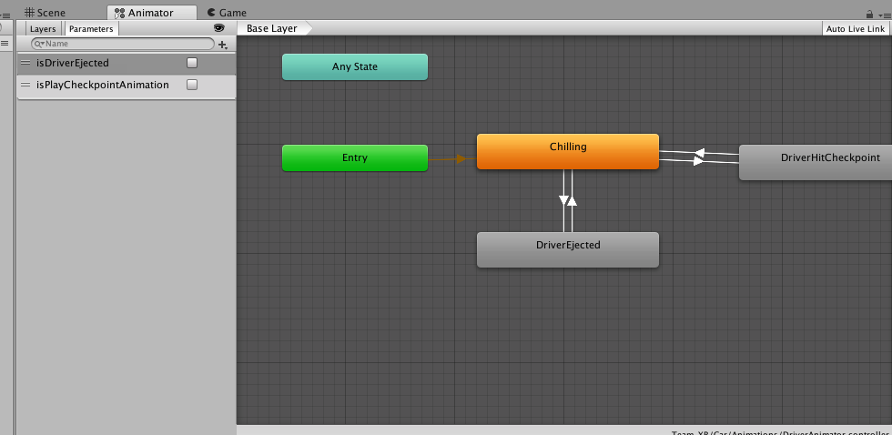
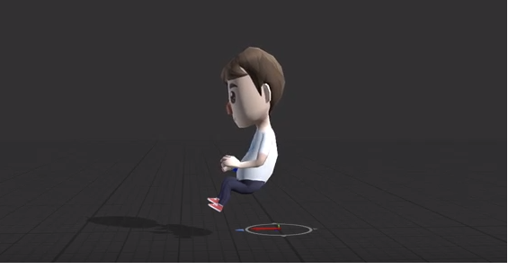
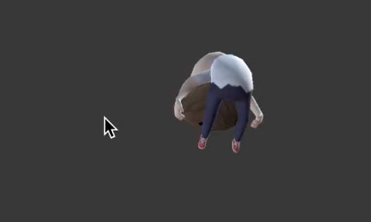
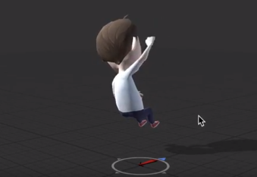
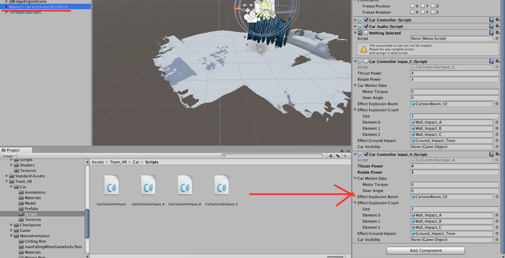

# Mixed Reality Racer (MRR)

Play a mix reality remote control car game with your Bridge headset. Hit all the checkpoints before you explode, avoid the tornado!


### Prerequisites

```
Unity 2017.2 + 
Bridge Headset, Control, for iPhone 7 and above
Structural Sensor
```
## Technical notes

### Special Effects
In `CarControllerInput` base class, the `TriggerGroundImpactEffect`, `TriggerWallImpactEffect`, and `TriggerGameOverBoomEffect` coroutines handle the special effects.

* `TriggerGroundImpactEffect`  is triggered when the car land on the floor from a jump, referenced by `OnCollisionEnter` 

* `TriggerWallImpactEffect` is triggered when the car hits a wall. A collision is a wall hit if the difference between the `collision.contacts[0].normal` and `Vector3.up` is less than 10f. referenced by `OnCollisionEnter`. We created three wall impact prefabs, so this coroutine randomlly choose an effect on collision.


* `TriggerGameOverBoomEffect` is triggered when the game runs out of time. it launches the driver ejected animation. This coroutine is referenced by `GameOverState` class `OnStateEnter`
method. 

The effects are stored in `Assets/Team_XR/Sean_VFX`, and are prefabs in the `CarControllerInput` base class.

### Driver Animation
A driver animator is attached to the driver prefab. the various states are activated by `isDriverEjected` and `isPlayCheckpointAnimation` boolean. 



__Chillling__ - this is the main state, driver is just driving. 



__DriverEjected__ - this state is triggered by the above `TriggerGameOverBoomEffect`



__DriverHitCheckpoint__ - this state launches a celebratory fist animation when the car hits a checkpoint.





### Car
We used the [low poly stylized car](https://assetstore.unity.com/packages/3d/vehicles/land/low-poly-stylized-cars-116415) and [character pack](https://assetstore.unity.com/packages/3d/characters/humanoids/character-pack-free-sample-79870) for our car and driver. "Underneath the hood", the car engine is a Unity standard vehicle asset and originally uses `CrossPlatformInput` for inputs. We modified the input method to fit for the Bridge headset remote control.  

### Controller
The `CarControllerInput` contains a `CarMotionData` class used for steering and power. The car's movement is updated by the `FixedUpdate` method

We have three controller styles available. 

`ControllerInputA` -uses DPAD for steering. Acceleration and braking is based on where you are pressing on DPAD relative to the center, hold the secondary buttons to reset

`ControllerInputB` -uses the 6 Axis rotation for steering, primary button for acceleration, secondary button for braking, hold both primary + secondary buttons to reset

`ControllerInputC` - uses the DPAD for steering, primary button for acceleration, and secondary button for braking. hold both primary + secondary buttons to reset

The default is ControllerInputA, to switch controllers, remove controllerInputX from the car, and swap in the desired controller, the controllers are stored in `Assets/Team_XR/Car/Scripts`




## Known Issues
Wall collision special effects are spawned multiple times per collision. We discovered it was a multi-thread issue involving the `collisionDetectionCall`. We will need to change the `isReadyEffect` boolean to a multi-thread friendly variable.


## Authors

* Samanthe Yueh - Scrum Master, UI/UX Designer

* Seán Conroy - Creative Lead

* Nick Kubash - Art Style Lead, 3D Artist

* Viet Phan - Programming Lead

* Andy Yao - Programmer

* Thalita Karina -  3D Motion Designer

* Manni Zhang - 3D Artist

## Acknowledgments
* Aaron Hilton at https://steampunk.digital/
* Jacob Ervin